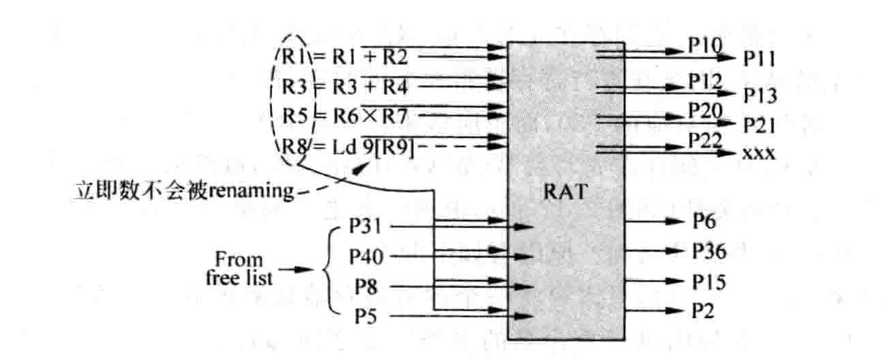
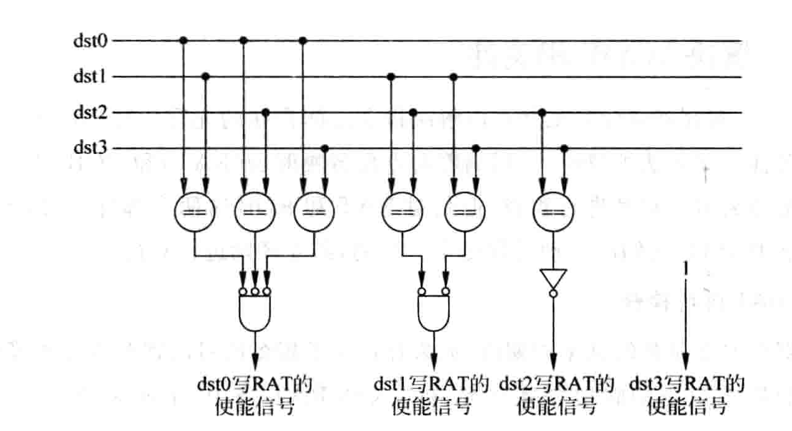

# 第七章：寄存器重命名

## 7.1 概述

- 数据相关性中，只有RAW是真相关，其他的可以通过不同的寄存器名字解决

---

WAW相关

```
R1 = R2 + R3
R1 = R4 * R5
```

可以改为

```
R1 = R2 + R3
R6 = R4 * R5
```

---

WAR相关

```
R1 = R2 * R3
R2 = R4 + R5
```

可以改为

```
R1 = R2 * R3
R6 = R4 + R5
```

---

寄存器重命名的原因

- 个数有限
- 程序中的循环体：不断地向某个寄存器写入，会导致大量WAW相关
- 代码重用：一段代码被重复调用，导致WAW相关

---


动态的寄存器重命名，消除WAW和WAR冒险。

重命名映射表可以通过SRAM或CAM来实现。


## 7.2 寄存器重命名的方式

（1）将逻辑寄存器ARF扩展来实现重命名

（2）使用统一的物理寄存器PRF来实现重命名

（3）使用ROB来实现重命名

三种方法的本质都是把逻辑寄存器映射到物理寄存器上面。

---

设计考虑的问题

（1）什么时候占用物理寄存器？寄存器来自哪里？

（2）什么时候释放物理寄存器？寄存器去向何处？

（3）分支预测失败，如何处理？

（4）发生异常，如何处理？

### 7.2.1 使用ROB进行寄存器重命名

- 当一条指令被写入ROB一个项时，这个项在ROB中的编号就是这条指令的**目的寄存器**对应的物理寄存器。（映射关系）

- 逻辑寄存器中存的是最新的值

- 还需要一个映射表来判断当前ARF的值是否最新，**应该从ARF中取值还是从PRF中取值？**（如果ROB中有写R1的指令，那么就需要从ROB中找到R1的值，因为此时ARF中的值不是最新的）

  

- 如果一个逻辑寄存器的值还在ROB中，则RRT会给出这个寄存器在ROB中的编号
- 如果指令提交，则这一项会被标记
- 缺点：增加了ROB读的复杂性，且操作数可能来自ROB，也可能来自ARF

### 7.2.2 将ARF扩展进行寄存器重命名

引入PRF（FIFO），当指令要写寄存器时，分配一个项，在映射表中记录地址，当指令要提交时，则释放在FIFO中的空间，并写回ARF。

也需要一个映射表。


一个逻辑寄存器的值在其生命周期内，仍然可能存在于PRF与ARF两个地方。


### 7.2.3 使用统一PRF进行寄存器重命名


- PRF中存储了所有**推测的(speculative)和正确的(retire)的**寄存器值
- 物理寄存器的个数多于指令集中定义的逻辑寄存器的个数
- 在PRF中
  - 没有和指令产生映射关系的寄存器：Free
  - 使用一个Free list来记录哪些寄存器空闲
- 若一条指令被寄存器重命名，且存在目的寄存器，就会占据PRF中的一个寄存器，就不在Free list里了
- 被占用的寄存器有3个不同状态
  - 值未计算出来
  - 值计算出来了，但没有提交
  - 已经提交
- 需要一个映射表，存储逻辑寄存器映射到物理寄存器的关系
- Free List可以用FIFO实现（四端口，因为要取出4条指令，最多要重命名4个目的寄存器）
- 在寄存器重命名阶段（此时不考虑存在相关性问题）
  - 源寄存器：查映射表，得到真实地址
  - 目的寄存器：查Free List，进行重命名

---

- 一条指令只有在retire（提交）后，才可以被外部看到，才是正确的
- 需要使用另外一个RAT，用以存储**已经提交的指令**和物理寄存器之间的关系！
- 这个在后面的寄存器重命名恢复过程中，会用得到
- 提交的时候写这个RAT，称为Architectural RAT
- 重命名时，读取的RAT时Speculative RAT，因为Spec RAT是最新的，考虑到所有正在执行的指令

---

- 一个物理寄存器不再被后面指令使用时，就变成空闲状态，**但如何才能知道后续指令是否还会使用这个物理寄存器呢**？？
- *之前的理解错误，认为只要提交了指令，就可以释放这个物理寄存器。*
- 一个保守的方法：相同的逻辑寄存器被再次写入


- 指令b对r1进行再次写入，则指令b对应的p6将替代p1，p1可以被释放
- 因此，还需要存储它之前对应的物理存储器（之前普林斯顿课上的Previous preg)


## 7.3 重命名映射表

重命名映射表（RAT）在实现层面上，有2中方式。一种是基于SRAM，一种是基于CAM。

- 基于SRAM的需要多端口（或者直接使用寄存器）
  
  - 例如，有32个ARF，有64个PRF，就需要32*6bits大小的寄存器
  - 使用ARF编号寻址PRF内容（ARF编号作为地址）
  
  
  
- 基于CAM的映射表
  - 大小等于物理寄存器的个数
  - 每个表项都存放逻辑寄存器的编号
  - 有点类似于全相联
  - 有Valid bit，比较方便用于CheckPoint的记录（相比SRAM）
  - 使用ARF编号作为内容寻址PRF
  
  
  
- 在分支指令时，需要保存CheckPoint，对SRAM来说，相当于需要保存所有的寄存器，而对于CAM而言，只需要将V往右进行移位就可以了

- 基于CAM的映射表仍然需要一个free list来记录哪些物理寄存器是空闲的

  - 一个物理寄存器何时空闲？后续指令写入同一逻辑寄存器（pPreg[a] = preg[b])，此时就可以释放之前对应的物理寄存器
  - 并不是有效位V为0就代表是空闲状态，有可能映射关系刚刚被覆盖
  - 空闲状态的管理不需要cRAT的参与

### 实例：使用CAM做寄存器重命名


（1）在分支指令F进行寄存器重命名时，需要对cRAT进行Checkpoint的保存，此时cRAT的内容如下表所示。


指令BDE都写寄存器r7，对每条指令的r7进行重命名。

- 在指令E进行寄存器重命名之后，物理寄存器P14就建立了和r7的对应关系，之前的2个映射关系全部无效（但不意味着这个物理寄存器现在空闲——**如何理解？为什么不能用？**P208一段话）

- 同时，有效位V全部被右移到了GC0进行备份

（2）F执行完之后，发现分支预测错误


在对cRAT进行恢复之前，状态如上表所示。

- 指令H重命名了r7，上面指令E对应的映射关系失效

- 分支指令F在预测失败后，进行状态恢复，将GC0的内容写到cRAT的有效位V，此时cRAT恢复到分支指令F进行寄存器重命名之前的状态。

- 指令B所占据的表项可能已经空闲，甚至被后续指令使用，但是恢复后，有效位变成了0.


理论上，有几个checkpoint，就能允许有几条分支指令存在于流水线中。

---

实例2：两条分支指令的情况：


- 第一条分支指令D对寄存器进行重命名时，保存状态到GC0

  


其中，A的重命名映射关系被覆盖，此时V变成了0

- 第二条分支指令G进行寄存器重命名时，继续对状态进行保存。此前，r9寄存器被重新命名了2次，导致E对应的映射关系被覆盖。


- 指令进行寄存器重命名完毕后，状态如下表所示：最后的HIJ指令覆盖了所有的映射关系


- 此时，如果发现分支指令D预测错误，需要使用GC0对cRAT进行恢复，还要对free list进行恢复（读指针），并且清除此后所有的GC
- （这个方法比较复杂，可以之后再研究，此时可以先弄清楚基于SRAM的重命名方式）


## 7.4 超标量处理器的寄存器重命名

### 一般步骤

对于`Dest = Src1 op Src2`的而言，

（1）从RAT中找到两个Src对应的物理寄存器PSrc（不同的扩展方式有不同的找法）


（2）从Free List中找到一个空闲的物理寄存器Pdest，作为指令的目的寄存器


（3）将逻辑寄存器Dest和物理寄存器PDest的映射关系写入重命名映射表RAT中。这样，使用Dest作为源寄存器的指令就可以正确寻址了。


对应4 way超标量处理器而言，每周期对4条指令进行寄存器重命名。**每条指令需要使用RAT的三个读端口，4条指令需要使用RAT的12个读端口，每条指令需要使用RAT的一个写端口**


### 同时重命名带来的相关性问题

还要考虑每个周期同时进行寄存器重命名的多条指令之间的相关性。


由于这四条指令是同时进行寄存器重命名的，会从RAT里读取信息，这样会造成错误的重命名，获取错误的数据。

（1）AB之间存在RAW相关，要先重命名r0，再从RAT读取r0对应的PR，不能同时

（2）ABD之间存在WAW，而再ROB中有保存指令对应的旧的映射关系，以方便指令退休时对旧的映射关系进行释放，因此，**在记录旧的映射关系时，需要使用之前和他存在WAW相关的指令的映射关系，而不是从RAT读取的映射关系**。例如，指令B将r0重命名为P31，旧的映射关系应该为P30，而不是从RAT读出的结果，由于几条指令是同时进行寄存器重命名的，所以需要注意这点。

（3）BD之间存在WAR相关，指令B读取r0，指令D写r0，这*问题不大*。

在超标量处理器设计中，寄存器重命名占用了大量的延迟，第一是SRAM多端口的延迟，第二是相关性处理造成的延迟。

> 像这种情况，对于指令ABD存在的相关性问题，在下面的解决中，只允许指令D写入映射表，那指令A和B怎么办？指令B的源操作数是指令A的目的操作数，而指令A的映射关系又被指令D覆盖了。这是个问题吗？
>
> 第一步：读出原有的映射关系，这里指的是操作数原有的映射关系和目的寄存器原有的映射关系，这个映射关系位于，在上面的指令序列中，以第一条指令A为例，读出r0, r1, r2之前对应的物理寄存器，读出r0对应的物理寄存器是为了之后提交后能够释放原来的物理寄存器进入Free List。读出r1, r2的对应关系是为了从物理寄存器堆中取操作数。这一步是并行发生的，存在的问题可能就是在指令AB中存在RAW冒险，此时，需要采用给r0新分配的物理寄存器号P30，而不是原有的映射关系（原有的r0映射关系已经无效了，在后面会被覆盖，所以不能用）
>
> 第二步：解决WAW冒险。通过寄存器重命名，我们解决了WAW冒险，下一步修改RAT时，应该以最新的映射关系为准，也就是r0映射到P33。注意，这一步是为之后的指令服务的。在前面的几条指令中，r0被分别映射到了P30和P31，这个关系并没有在RAT中记录，因为我们已经读完了RAT，源操作数信息（对应的物理寄存器）已经就绪；写RAT，是为了后面的指令服务，这四条指令将不再读RAT的内容。
>
> 值得注意的是，指令AB中r0的映射关系不在RAT中记录，但是会在ROB中记录，在提交指令时，P30、P31会被逐个释放到自由列表。

### 7.4.1 解决RAW相关性（读原有的映射关系）

- 这一步主要是读出原有的映射关系
- 如果存在新分配的



上图表示的是不存在RAW相关性的寄存器重命名过程，而下图展示的是存在RAW相关性，但没有进行处理时，寄存器的重命名过程。


- 在寄存器重命名阶段，指令的顺序还是in-order的，需要把**每一条指令的源寄存器编号和前面所有指令的目的寄存器编号**进行比较，如果存在一个相等的项，就从当前周期的Free List输出对应值，如果存在多个相等的项，就选择最新的那条指令。


组内相关性检查的电路和访问RAT是并行工作的，不会对处理器的周期产生负面影响。

越后面的指令，需要的比较就越多。

### 7.4.2 解决WAW相关性（写入）

WAW相关性虽然对执行过程没有什么影响，但是对后续的ROB写入和寄存器的释放有影响。

---

**对写RAT进行检查**

在重命名这个周期内，如果有多条指令的目的寄存器都相等，只有最新的映射关系才允许写入RAT。


**设置一个写使能信号：是否更新RAT？由于后续指令可能会覆盖，所以只允许一组存在WAW相关的指令中，最新的指令更新**

和上面相反的是，越靠前的指令需要检查的越多。



这里，RAT中映射关系被覆盖了，并不代表**寄存器已经空闲了**，它可能还在被**中间的指令所使用**，例如，指令C的源寄存器如果是r0，r0在重命名阶段已经被分配了一个寄存器，只是这个对应关系没有被写入RAT，

---

**对写ROB进行检查**

- 每一条指令都需要从RAT中读出之前对应的物理寄存器，并写到ROB的pPReg中。

- 在写ROB的时候，也同样需要对相关性进行检测

- 在RAT中，映射关系已经建立，而ROB中写入是为了管理Free List

  

- 例如，在上面这条指令D要写ROB时，应该采用指令B的P31，而不是从RAT读出r0之前对应的寄存器。
- 在写ROB的过程是并行的，寄存器重命名阶段也会写ROB！！

> 对于指令B，其pPreg的值应该来自指令A映射的P30
>
> 对于指令D，其pPreg的值应该来自指令B映射的P31


**实现过程中的一些要点**

> 1. 需要采用读优先的RAM，因为需要先读出旧的映射关系，才能写入新的映射关系。
> 2. 有的指令没有目的寄存器，有的指令源操作数是立即数，需要对这些指令进行标记，并决定从Free List中读取数值的个数。
> 3. 使用目的寄存器读取RAT时，目的寄存器不存在的指令不读取RAT，也不改写RAT（不需要分配寄存器）
> 4. 使用源寄存器读取RAT时，如果源寄存器不存在，直接忽略从RAT读取的结果即可

## 7.5 寄存器重命名过程的恢复

- 流水线中的指令都处于推测执行的状态（speculative）
- 指令在离开流水线（退休）之前，都可能被抹掉
- 如何对已经占用的资源（分配的物理寄存器等）进行恢复？
  - CheckPoint
  - WALK
  - Architecture State

### 7.5.1 CheckPoint

将32个寄存器的对应关系原样保存下来。

- 分为随机访问的Checkpoint和串行访问的Checkpoint

  


- 串行访问的Checkpoint需要多个周期才可以恢复
- 这类的设计需要从电路的层面进行实现，在FPGA上比较难实现
- 所以用cRAT实现的Checkpoint比较适用于FPGA

### 7.5.2 使用WALK

- 利用ROB中存储的信息，进行逐条恢复

> 例如，发现一条分支指令预测失败时，使用这条分支指令的编号，把流水线中相关的都抹去，从ROB的末端（最新的指令）开始，逐条将每条指令之前对应的映射关系写回到RAT中。

- 在正确路径上的指令，会在ROB中提交
- 需要逐个指令恢复
- **使用Checkpoint对分支预测失败进行恢复，使用WALK对异常进行恢复**

### 7.5.3 使用Architectural State


使用2个不同的RAT，只有指令的结果提交后，才能在Architectural RAT中看到映射关系，其他的映射关系都只能在Speculative RAT中看到。

当发现分支预测失败或异常发生时，**等待这条指令变成ROB中最旧的指令**，然后将Architecture RAT复制到Speculative RAT中。